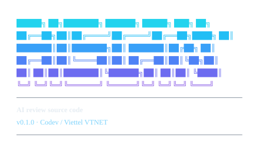

<div align="center">
  
</div>

# AIScan — Công cụ AI đánh giá an toàn thông tin source code

Công cụ/agent nội bộ dùng LLM đánh giá an toàn thông tin source code, chạy trên
**Codev Code** (fork của OpenCode) với LLM nội bộ, tích hợp vào **Codev/GitLab**
dưới dạng agent.

## Vấn đề và cách giải

- SAST truyền thống (Fortify): false positive cao, dev dần bỏ qua cảnh báo.
- Lỗi phụ thuộc ngữ cảnh nghiệp vụ (phân quyền, logic, luồng đa module) SAST hay bỏ sót.

Cách giải của AIScan: pipeline 7 giai đoạn điều phối bằng **mã Python tất định**,
mỗi phát hiện phải qua **hội đồng phản biện 3 phiếu độc lập** (3 lens, mặc định
bác bỏ) trước khi vào báo cáo. Mọi con số trong báo cáo — số ứng viên, số phiếu,
độ phủ — do Python tính, không do model tự khai, nên báo cáo kiểm chứng được.

## Cấu trúc repo

| Thư mục / file | Nội dung |
|---|---|
| `nghien_cuu_khao_sat/` | Báo cáo khảo sát hiện trạng (`W1.pdf`) |
| `thiet_ke/` | **`thiet_ke.md`** — tài liệu thiết kế duy nhất; `benchmark/` (gitignore) |
| `phat_trien_loi/` | Công cụ AIScan — mã nguồn, prompt, fixture |
| `_tham_khao/` | Bản gốc plugin tham khảo (`claude-security-goc/`) |
| `codev.json` | **Bắt buộc** — provider cổng nội bộ + 8 agent AIScan + quyền của từng agent; không có nó thì `/aiscan` không chạy |
| `.env` | Khoá và URL cổng — **không commit**, đã gitignore |
| `pyproject.toml` | Khai báo package `aiscan` |
| `NOTICE.md` | Điều khoản MITRE cho dữ liệu CWE (bắt buộc giữ) |
| `.gitattributes` | Ép LF cho mọi file text |

Bên trong `phat_trien_loi/`:

```
run.py            Điểm vào: tự nạp .env, tự thêm thư mục chứa package vào import path
prompts/          Prompt tiếng Anh của 8 vai (nguồn duy nhất);
                  output cho người dùng do lead dịch sang tiếng Việt
aiscan/lib/       Tất định, không gọi LLM: identity, cwe (944 CWE map),
                  finding (schema), strictjson, source, sarif, secret,
                  banner, console…
aiscan/orchestrator/  Điều phối: plan (lens/effort), corpus (đóng gói mã),
                  codev/direct (runner gọi cổng LLM), scan (pipeline 7 giai đoạn)
aiscan/cli/       5 lệnh tất định: scan, write_scan_meta, save_result,
                  render_report, patch_artifacts
fixtures/         Repo mẫu để thử (vuln-webapp)
```

## 8 agent của hội đồng

Định nghĩa trong `codev.json` (model, temperature, quyền từng vai); prompt ở
`phat_trien_loi/prompts/`. Chỉ lead có kênh nói chuyện với người dùng; các vai
còn lại được pipeline Python điều phối — không do model tự điều phối.

| Agent | Nhiệm vụ | Tool được cấp |
|---|---|---|
| `aiscan-lead` | Đối thoại với người dùng: in banner, đo kích thước repo, phỏng vấn scope + effort, xác nhận chi phí, phát lệnh quét, trình báo cáo bằng tiếng Việt | `bash` (chỉ `run.py`, git đọc, `ls`, `date`) + câu hỏi |
| `aiscan-inventory` | Chia repo thành component ~25 file; mọi thư mục top-level phải nằm trong sổ quét hoặc sổ bỏ qua | `read`/`grep`/`glob` |
| `aiscan-threat-model` | Mô hình hoá 1 component: entry point, sink, assumption, trust boundary, `hotFiles` | `read`/`grep`/`glob` + git đọc |
| `aiscan-researcher` | Săn lỗ hổng thật theo 1 component × 1 lens; mỗi finding neo đúng `file:line` kèm snippet | như trên (+ gọi `aiscan-explore`) |
| `aiscan-sweep` | Lấp khoảng trống: file ngoài path đã phủ, lỗi giữa các component, secret commit | như trên (+ `aiscan-explore`) |
| `aiscan-verifier` | 1 phiếu / 1 lens (`REACHABILITY`, `IMPACT`, `DEFENSES`) — nhiệm vụ **chứng minh finding sai** | như trên (+ `aiscan-explore`) |
| `aiscan-red-team` | Chỉ mức `max`: xét cả 3 lens cùng lúc, tìm lý do mạnh nhất để bác | như trên (+ `aiscan-explore`) |
| `aiscan-explore` | Dẫn đường chỉ đọc: tìm file, lan theo luồng, liệt kê caller | `read`/`grep`/`glob` + git đọc |

## Chạy một lượt quét

Từ thư mục `phat_trien_loi/`:

```
python run.py                  banner màu + bảng chọn (repo, chế độ, effort)
python run.py <repo>           banner + bảng chọn cho repo đó
python run.py scan <repo>      quét thẳng code-base, không hỏi
python run.py banner           chỉ in banner (màu ở terminal thật)
```

- Ctrl+C huỷ ở bất cứ bước nào: lượt gọi đang xếp hàng bị bỏ, số đo token vẫn
  ghi vào `<report>/.aiscan-run/metrics.json`.
- `run.py` tự nạp `.env` (khoá cổng) và tự thêm thư mục chứa package `aiscan/`
  vào đường dẫn — không cần PYTHONPATH.

### Banner và bảng chọn

`python run.py` (không tham số) mở màn bằng banner rồi đưa bảng chọn:

```
──────────────────────────────────────────────────────────
  CHỌN CHẾ ĐỘ QUÉT
  repo  C:\duong\dan\repo

  1  code-base   Quét cả repository (mặc định)
                 7 giai đoạn · báo cáo + SARIF
  2  changes     Quét thay đổi của nhánh/commit  — sắp có
  3  patch       Đề xuất patch từ finding của báo cáo  — sắp có
  q  thoát
──────────────────────────────────────────────────────────
Mức cố gắng (low · medium · high · max)  [Enter = low] — cao hơn = rà kỹ hơn, tốn token hơn:
```

### Quét qua agent trong Codev

Mở `codev` **từ thư mục cần quét**, gõ `/aiscan`: agent `aiscan-lead` in banner,
phỏng vấn (scope + effort, một lần), xác nhận chi phí, phát đúng một lệnh quét
rồi im lặng đến khi có báo cáo. Prompt các vai là tiếng Anh; mọi câu trả lời cho
người dùng bằng tiếng Việt.

### Mức công

| Mức | Component | Lượt/ô | Sweep | Đối kháng |
|---|---|---|---|---|
| `low` | 1 (cả repo) | 1, gộp mọi lens | 0 | không |
| `medium` | ≤24 | 1 | 1 | không |
| `high` | ≤48 | 2 | 2 | không |
| `max` | ≤48 | 2 | 2 | repanel + red-team |

`--budget` giới hạn lượt gọi agent; ứng viên vượt trần vào `pending` và công cụ
in số `--budget` đề nghị chạy tiếp. Hai chế độ `changes` và `patch` chưa có
pipeline — chọn vào chỉ nhận thông báo.

## Trạng thái

- Đã có: báo cáo khảo sát hiện trạng; tài liệu thiết kế đầy đủ
  (`thiet_ke/thiet_ke.md`); pipeline 7 giai đoạn chạy thông với model thật
  (`codevgw/zai-org/GLM-5.3-Flash`), nhiều lượt quét trọn vẹn sinh báo cáo +
  SARIF trong ngày 09-09-2026.
- Việc tồn ưu tiên cao:
  1. Số liệu baseline của hiện trạng — đang trống, không có thì không có gì để so.
  2. Nhóm A trong `thiet_ke/thiet_ke.md` §6.5 — các lỗi chặn quy mô lớn
     (trần 600, budget, pack) phải sửa trước khi quét repo thật.
  3. Shard nối tiếp (lượt ≥ 2), chế độ `changes`/`patch`, tích hợp GitLab CI.

## Tài liệu

- **Thiết kế đầy đủ** (kiến trúc, luồng, đặc tả engine, token, báo cáo):
  `thiet_ke/thiet_ke.md` — tài liệu thiết kế duy nhất.
- Giấy phép CWE: `NOTICE.md`. Nguồn gốc: mục 8 của `thiet_ke/thiet_ke.md`.
